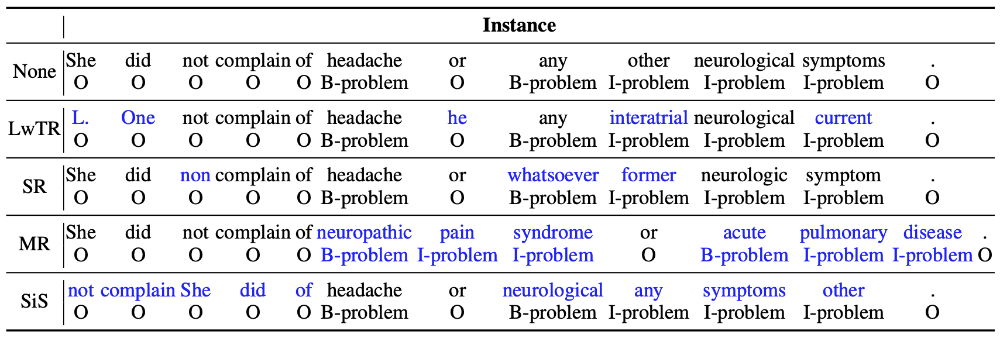

# neraug

This python library helps you with augmenting text data for named entity recognition.

## Augmentation Example

  
Reference from [An Analysis of Simple Data Augmentation for Named Entity Recognition](https://aclanthology.org/2020.coling-main.343/)

## Installation

To install the library:

```bash
pip install neraug
```

## Usage

One of the example algorithms: `DictionaryReplacement`:

```python
>>> from neraug.augmentator import DictionaryReplacement
>>> from neraug.scheme import IOBES

>>> ne_dic = {'Tokyo Big Sight': 'LOC'}
>>> augmentator = DictionaryReplacement(ne_dic, str.split, IOBES)
>>> x = ['I', 'went', 'to', 'Tokyo']
>>> y = ['O', 'O', 'O', 'S-LOC']
>>> x_augs, y_augs = augmentator.augment(x, y, n=1)   
>>> x_augs
[['I', 'went', 'to', 'Tokyo', 'Big', 'Sight']]
>>> y_augs
[['O', 'O', 'O', 'B-LOC', 'I-LOC', 'E-LOC']]
```

The library supports the following algorithms:

- DictionaryReplacement
- LabelWiseTokenReplacement
- MentionReplacement
- ShuffleWithinSegment

and supports the following scheme:

- IOB2
- IOBES
- BILOU

## Reference

Appreciate for the following research:

- [An Analysis of Simple Data Augmentation for Named Entity Recognition](https://aclanthology.org/2020.coling-main.343/)

## Citation

```latex
@misc{neraug,
  title={neraug: A data augmentation tool for named entity recognition},
  author={Hiroki Nakayama},
  url={https://github.com/Hironsan/neraug},
  year={2021}
}
```
